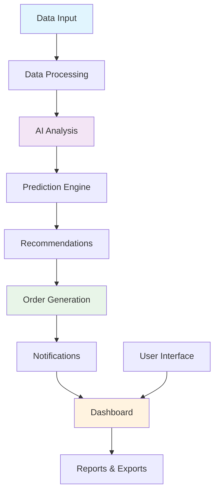

# Automated Re-Order Concierge

[](https://www.python.org/)
[](https://streamlit.io/)
[](https://openai.com/)
[](https://pandas.pydata.org/)
[](https://opensource.org/licenses/MIT)

An intelligent automated re-ordering system that analyzes usage patterns and predicts when products need to be reordered. Built with AI-powered insights and inventory management capabilities.

## Table of Contents
- [Overview](#overview)
- [Features](#features)
- [Quick Start](#quick-start)
- [Architecture](#architecture)
- [Installation](#installation)
- [Usage](#usage)
- [Data Processing](#data-processing)
- [AI Predictions](#ai-predictions)
- [Configuration](#configuration)
- [API Reference](#api-reference)
- [Project Structure](#project-structure)
- [Contributing](#contributing)
- [License](#license)

## Overview

Automated Re-Order Concierge is an intelligent inventory management system that uses AI to predict when products need to be reordered based on historical usage data, seasonal trends, and business patterns. It helps businesses optimize inventory levels, reduce stockouts, and minimize carrying costs.

## Features

- **🤖 AI-Powered Predictions**: Uses machine learning to forecast re-order needs
- **📊 Inventory Analytics**: Comprehensive dashboard with key metrics and insights
- **🔔 Smart Notifications**: Automated alerts for low stock and re-order points
- **📈 Trend Analysis**: Identify seasonal patterns and usage trends
- **🔄 Supplier Management**: Track supplier information and lead times
- **📋 Order Generation**: Automatically generate purchase orders
- **📱 Mobile Responsive**: Access from any device with a web browser
- **🔒 Data Security**: Secure handling of inventory and business data
- **📤 Export Capabilities**: Export reports in CSV, Excel, and PDF formats
- **🔧 Customizable Rules**: Set custom re-order thresholds and rules

## Quick Start

### Prerequisites
- Python 3.9 or higher
- OpenAI API key (for AI features)
- Modern web browser

### Installation

1. **Clone the repository**
```bash
git clone https://github.com/znblrean/Automated-Re-Order-Concierge.git
cd Automated-Re-Order-Concierge
```

2. **Set up virtual environment**
```bash
python -m venv venv
source venv/bin/activate  # On Windows: venv\Scripts\activate
```

3. **Install dependencies**
```bash
pip install -r requirements.txt
```

4. **Configure environment**
```bash
cp .env.example .env
# Edit .env file with your OpenAI API key
```

5. **Run the application**
```bash
streamlit run app.py
```

6. **Access the app** at `http://localhost:8501`

## Architecture



## Installation

### Detailed Setup

1. **System Requirements**
```bash
# Verify Python version
python --version  # Should be 3.9 or higher

# Verify pip is installed
pip --version
```

2. **Install with Docker (Alternative)**
```bash
# Build Docker image
docker build -t reorder-concierge .

# Run container
docker run -p 8501:8501 reorder-concierge
```

3. **Development Installation**
```bash
# Install development dependencies
pip install -r requirements-dev.txt

# Install pre-commit hooks
pre-commit install
```

## Usage

### Getting Started

1. **Initial Setup**
   - Upload your inventory data (CSV, Excel)
   - Configure suppliers and lead times
   - Set re-order thresholds and rules

2. **Dashboard Overview**
   - View inventory status at a glance
   - Monitor critical alerts
   - Access quick actions

3. **Data Import**
   ```python
   # Example data format
   import pandas as pd
   data = pd.DataFrame({
       'product_id': ['P001', 'P002'],
       'product_name': ['Product A', 'Product B'],
       'current_stock': [50, 100],
       'min_stock': [20, 30],
       'lead_time_days': [7, 14],
       'supplier': ['Supplier X', 'Supplier Y']
   })
   ```

### Core Workflows

#### 1. Inventory Monitoring
- Real-time stock level tracking
- Automatic low-stock detection
- Historical usage analysis

#### 2. AI-Powered Predictions
- Demand forecasting
- Seasonal trend analysis
- Lead time optimization

#### 3. Order Management
- Automatic PO generation
- Supplier communication templates
- Order tracking

#### 4. Reporting
- Inventory health reports
- Cost analysis
- Performance metrics

## Data Processing

### Supported Data Formats
- **CSV**: Comma-separated values
- **Excel**: .xlsx and .xls files
- **JSON**: JavaScript Object Notation
- **Database**: SQLite, PostgreSQL (via connectors)

### Data Structure

```python
# Required fields for inventory data
required_fields = [
    'product_id',          # Unique product identifier
    'product_name',        # Product description
    'category',            # Product category
    'current_stock',       # Current inventory level
    'min_stock',           # Minimum stock threshold
    'max_stock',           # Maximum stock capacity
    'unit_cost',           # Cost per unit
    'lead_time_days',      # Supplier lead time
    'supplier_id',         # Supplier identifier
    'last_order_date',     # Date of last order
    'average_daily_usage'  # Historical usage rate
]
```

### Data Validation
- Type checking and conversion
- Range validation
- Consistency checks
- Duplicate detection

## AI Predictions

### Machine Learning Models

1. **Time Series Forecasting**
   - ARIMA models for seasonal patterns
   - Exponential smoothing
   - Prophet for trend detection

2. **Demand Prediction**
   - Regression models
   - Neural networks for complex patterns
   - Ensemble methods for accuracy

3. **Anomaly Detection**
   - Identify unusual usage patterns
   - Detect data quality issues
   - Flag potential problems

### Prediction Features

```python
prediction_features = {
    'historical_sales': 'Past sales data',
    'seasonal_factors': 'Seasonal adjustments',
    'promotional_impact': 'Marketing effects',
    'economic_indicators': 'Market conditions',
    'competitor_activity': 'Market dynamics',
    'weather_patterns': 'Environmental factors'
}
```

## Configuration

### Environment Variables

Create a `.env` file with:

```env
# API Keys
OPENAI_API_KEY=your_openai_api_key_here
DATABASE_URL=sqlite:///inventory.db

# Application Settings
APP_NAME="Automated Re-Order Concierge"
DEBUG=False
PORT=8501
HOST=0.0.0.0

# Email Settings (for notifications)
SMTP_SERVER=smtp.gmail.com
SMTP_PORT=587
EMAIL_USER=your_email@gmail.com
EMAIL_PASSWORD=your_app_password

# Business Rules
REORDER_THRESHOLD=0.2  # Reorder at 20% above min stock
SAFETY_STOCK_DAYS=7    # Additional safety stock in days
NOTIFICATION_DAYS=3    # Days before stockout to notify
```

### Application Settings

```python
# config/settings.py
class Settings:
    # Inventory rules
    REORDER_POINT_MULTIPLIER = 1.2
    SAFETY_STOCK_RATIO = 0.1
    MAX_ORDER_QUANTITY = 1000
    
    # AI Settings
    PREDICTION_HORIZON_DAYS = 30
    CONFIDENCE_THRESHOLD = 0.8
    MODEL_RETRAIN_DAYS = 7
    
    # UI Settings
    ITEMS_PER_PAGE = 50
    AUTO_REFRESH_MINUTES = 5
    DEFAULT_CURRENCY = "USD"
```

## API Reference

### Core Classes

#### InventoryManager
```python
class InventoryManager:
    def __init__(self, config):
        """Initialize inventory manager with configuration"""
        
    def check_stock_levels(self) -> List[Alert]:
        """Check all products against reorder thresholds"""
        
    def generate_recommendations(self) -> List[Recommendation]:
        """Generate AI-powered reorder recommendations"""
        
    def create_purchase_order(self, items: List[Dict]) -> PurchaseOrder:
        """Generate purchase order for recommended items"""
```

#### PredictionEngine
```python
class PredictionEngine:
    def predict_demand(self, product_id: str, days: int) -> Prediction:
        """Predict demand for specific product"""
        
    def calculate_reorder_point(self, product_data: Dict) -> float:
        """Calculate optimal reorder point"""
        
    def analyze_trends(self) -> TrendAnalysis:
        """Analyze inventory and usage trends"""
```

#### NotificationService
```python
class NotificationService:
    def send_alert(self, alert: Alert, recipients: List[str]):
        """Send alert notification"""
        
    def schedule_daily_report(self):
        """Schedule and send daily inventory report"""
        
    def notify_supplier(self, purchase_order: PurchaseOrder):
        """Notify supplier about new order"""
```

### REST API Endpoints

```python
# app.py - Streamlit app with API endpoints
@app.route('/api/inventory', methods=['GET'])
def get_inventory():
    """Get current inventory status"""
    
@app.route('/api/recommendations', methods=['POST'])
def get_recommendations():
    """Get AI-generated reorder recommendations"""
    
@app.route('/api/orders', methods=['POST'])
def create_order():
    """Create purchase order from recommendations"""
```

## Project Structure

```
Automated-Re-Order-Concierge/
├── app.py                    # Main Streamlit application
├── requirements.txt          # Python dependencies
├── Dockerfile               # Docker configuration
├── docker-compose.yml       # Docker Compose setup
├── .env.example            # Environment variables template
├── README.md               # Project documentation
├── config/                 # Configuration files
│   ├── __init__.py
│   ├── settings.py         # Application settings
│   ├── constants.py        # Business constants
│   └── rules.py           # Business rules configuration
├── core/                   # Core business logic
│   ├── __init__.py
│   ├── inventory.py       # Inventory management
│   ├── predictions.py     # AI prediction engine
│   ├── orders.py         # Order management
│   └── notifications.py   # Notification system
├── data/                  # Data handling
│   ├── __init__.py
│   ├── models.py         # Data models
│   ├── processors.py     # Data processors
│   ├── validators.py     # Data validation
│   └── database.py       # Database operations
├── ui/                    # User interface components
│   ├── __init__.py
│   ├── dashboard.py      # Main dashboard
│   ├── inventory_view.py # Inventory display
│   ├── reports.py        # Reporting components
│   └── forms.py         # Input forms
├── utils/                 # Utility functions
│   ├── __init__.py
│   ├── helpers.py        # Helper functions
│   ├── exporters.py      # Data export utilities
│   └── analytics.py      # Analytics utilities
├── tests/                 # Test suite
│   ├── __init__.py
│   ├── test_inventory.py # Inventory tests
│   ├── test_predictions.py # Prediction tests
│   ├── test_orders.py    # Order tests
│   └── test_integration.py # Integration tests
├── docs/                  # Documentation
│   ├── api.md           # API documentation
│   ├── user_guide.md    # User guide
│   ├── deployment.md    # Deployment guide
│   └── screenshots/     # Application screenshots
└── assets/               # Static assets
    ├── images/          # Image assets
    ├── styles/          # CSS styles
    └── templates/       # Email/notification templates
```

## Contributing

We welcome contributions! Please see our [Contributing Guidelines](CONTRIBUTING.md) for details.

### Development Workflow

1. **Fork the repository**
2. **Create a feature branch**
```bash
git checkout -b feature/your-feature-name
```

3. **Make your changes**
```bash
# Install development dependencies
pip install -r requirements-dev.txt

# Run tests
pytest tests/

# Check code style
black . --check
flake8 .
```

4. **Commit your changes**
```bash
git add .
git commit -m "Add: Description of your feature"
```

5. **Push and create pull request**
```bash
git push origin feature/your-feature-name
```

### Code Standards
- Follow PEP 8 style guide
- Write comprehensive docstrings
- Include type hints
- Add tests for new features
- Update documentation

### Testing
```bash
# Run all tests
pytest

# Run with coverage
pytest --cov=core --cov=utils tests/

# Run specific test file
pytest tests/test_inventory.py -v
```

## License

This project is licensed under the MIT License - see the [LICENSE](LICENSE) file for details.

## Support

- 📧 **Email**: Zenoomalik@gmail.com
- 🐛 **Issues**: (https://github.com/znblrean/Automated-Re-Order-Concierge/issues)
- 💬 **Discussions**: (https://github.com/znblrean/Automated-Re-Order-Concierge/discussions)
- 📚 **Documentation**: [Wiki](https://github.com/znblrean/Automated-Re-Order-Concierge/wiki)

## Acknowledgments

- [Streamlit](https://streamlit.io/) for the amazing web framework
- [OpenAI](https://openai.com/) for AI capabilities
- [Pandas](https://pandas.pydata.org/) for data manipulation
- Contributors and users of this project

## Roadmap

### Upcoming Features
- [ ] Multi-warehouse support
- [ ] Integration with popular e-commerce platforms
- [ ] Mobile app version
- [ ] Advanced predictive analytics
- [ ] Supplier portal integration
- [ ] API for third-party integrations

### Known Issues
- Check [GitHub Issues](https://github.com/znblrean/Automated-Re-Order-Concierge/issues) for current issues and planned fixes.

---

**⭐ If you find this project useful, please consider giving it a star on GitHub!**
